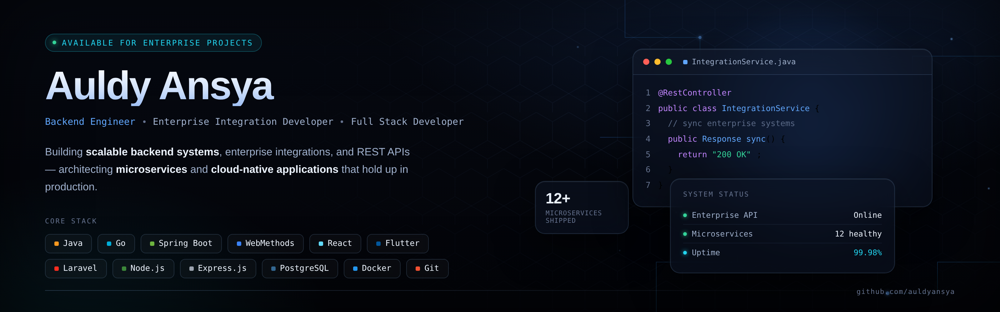

<div align="center">

<!-- Banner: upload the PNG from our earlier banner design into an /assets folder in this repo,
     then point this src at the raw GitHub URL, e.g.
     https://raw.githubusercontent.com/aulansah/aulansah/main/assets/banner.png -->


<br/>

<a href="https://git.io/typing-svg">
  
</a>

<br/><br/>

<a href="mailto:aulansah@gmail.com"></a>
<a href="https://linkedin.com/in/auldyansya"></a>


</div>

<br/>

## About Me

I'm a software engineer who started in **mobile**, moved into **enterprise middleware for banking**, and is currently building toward **fullstack**. Right now I build and maintain the integration layer between core banking systems and external billers/switchers for a bank-scale platform — real transactions, real uptime requirements.

```yaml
name:      Auldy Ansya Rullah
role:      Middleware Developer (Banking Integration)
background: Mobile Developer (Kotlin/Java, Flutter/Dart) since 2021
currently: Learning Fullstack Web Dev @ kelasfullstack.id · Learning Go @ Programmer Zaman Now
based_in:  Indonesia
education: B.Sc. Information Technology — Institut Teknologi Telkom Surabaya (2018–2022)
```

- 🏦 Currently building **payment & core-banking integrations** (Universal Biller Payment / SOA) with **Software AG webMethods** — Designer, API Gateway, Adapters, REST services
- 📱 Background as a **mobile developer** — native Android (Kotlin/Java) and Flutter, with apps shipped to production on both Play Store and App Store
- 🎓 Trained to **Expert level on Dicoding** across two tracks: Mobile Development and Back-End Development
- 🚀 Currently expanding into **fullstack web development** and **Go**, aiming to become a backend engineer who's equally comfortable across integration, services, and infra

---

## My Path

<table>
<tr><td width="140"><b>2021</b></td><td>
Mobile Development track at <b>Bangkit Academy</b> (by Google, Tokopedia, Gojek & Traveloka) — Kotlin, Jetpack, on-device ML with TensorFlow Lite. Certified <i>Mobile Development Specialist</i>.
</td></tr>
<tr><td><b>2021–2023</b></td><td>
Went deep on <b>Dicoding</b> — reached <i>Expert</i> level in both the Android/Flutter track and the Back-End Development track (Fundamentals of Back-End, Creating Back-End Applications, Cloud Practitioner, Architecting on AWS).
</td></tr>
<tr><td><b>2022–2023</b></td><td>
<b>Mobile Developer</b> at PT Sigma Cipta Caraka (Telkom Sigma) — production Flutter apps with Clean Architecture + BLoC, Firebase, REST integration, published to Play Store & App Store.
</td></tr>
<tr><td><b>2023–Now</b></td><td>
<b>Middleware Developer</b> at PT Swadarma Duta Data, on-site for PT Bank Negara Indonesia (BNI) — building and running <b>Software AG webMethods</b> integrations (Designer, API Gateway, Adapters) for Universal Biller Payment / SOA across ATM Jalin, Agen46, BNI Direct, Wondr, SMS Banking, and Teller channels.
</td></tr>
<tr><td><b>Now Learning</b></td><td>
Fullstack Web Development at <b>kelasfullstack.id</b>, and <b>Go</b> through Programmer Zaman Now — working toward being a backend engineer across integration, services, and full-stack delivery.
</td></tr>
</table>

---

## Tech Stack

**Middleware & Integration**
<br/>


**Backend**
<br/>


**Mobile** <sub>(where I started)</sub>
<br/>


**Frontend** <sub>(currently building at kelasfullstack.id)</sub>
<br/>


**Database**
<br/>


**Tools & Platform**
<br/>


---

## Currently Learning

| Track | Where | Focus |
|---|---|---|
| Fullstack Web Development | **kelasfullstack.id** | End-to-end web apps: React/Next.js on top, Node.js underneath |
| Go (Golang) | **Programmer Zaman Now** | Backend fundamentals, moving toward Go for services |
| Clean Architecture & System Design | Self-study + on the job | Applying it to both mobile and backend work |
| Microservices & Cloud-Native | Self-study | Where webMethods integration work is heading next |

---

## Certifications

- 🎖️ **Mobile Development Specialist** — Bangkit Academy by Google, Tokopedia, Gojek & Traveloka (2021)
- 🎖️ **Become a Flutter Developer Expert** — Dicoding (2022)
- 🎖️ **Become an Android Developer Expert** — Dicoding (2021)
- 🎖️ **Architecting on AWS** — Dicoding (2022)
- 🎖️ **Cloud Practitioner Essentials** — Dicoding (2022)
- 🎖️ **Learn Fundamentals of Back-End Applications** — Dicoding (2023)
- 🎖️ **Creating Back-End Applications for Beginners** — Dicoding (2022)

---

## Featured Repositories

<div align="center">
<a href="https://github.com/aulansah/webmethods-integration-lab"></a>
<a href="https://github.com/aulansah/belajar-golang-dasar"></a>
<a href="https://github.com/aulansah/KasPintar"></a>
<a href="https://github.com/aulansah/list-undangan-wedding"></a>
</div>

- 🧩 **webmethods-integration-lab** — hands-on Software AG webMethods integration examples: Designer flows, API Gateway policies, adapters, best practices from real banking integration work.
- 🐹 **belajar-golang-dasar** — Go fundamentals roadmap, following the Programmer Zaman Now curriculum, as I build toward backend engineering in Go.
- 💰 **KasPintar** — personal finance management app.
- 💌 **list-undangan-wedding** — digital wedding invitation & guest list app.

> Client/production work (BNI banking integrations, Flutter apps for Telkom Sigma, PERURI's e-Meterai app, RAPIM Telkom Group) is closed-source and not published here — see the **[full CV](#-contact)** for details on that experience.

---

## GitHub Stats

<div align="center">


</div>

---

## Career Goal

Grow into a **Backend / Integration Engineer** who owns systems end-to-end — from the middleware and API layer I already work in daily, out toward microservices, cloud-native infrastructure, and full-stack delivery.

- [x] Middleware & enterprise integration (webMethods, SOA)
- [x] Mobile development (Kotlin, Flutter) — production apps shipped
- [ ] Fullstack web development — in progress @ kelasfullstack.id
- [ ] Go backend services — in progress @ Programmer Zaman Now
- [ ] Microservices & cloud-native architecture
- [ ] System design at scale

---

## Contact

- 💼 LinkedIn — [linkedin.com/in/auldyansya](https://linkedin.com/in/auldyansya)
- 📧 Email — [aulansah@gmail.com](mailto:aulansah@gmail.com)
- 🐙 GitHub — [@aulansah](https://github.com/aulansah)
- 📍 Sumatera Selatan, Indonesia

<br/>

<div align="center">
<i>"Build scalable software. Keep learning. Share knowledge."</i>
</div>
